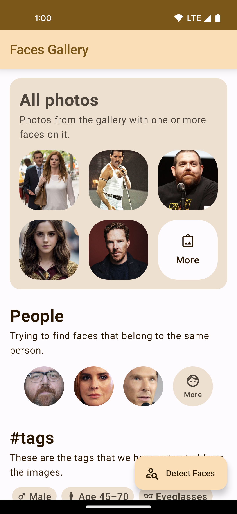
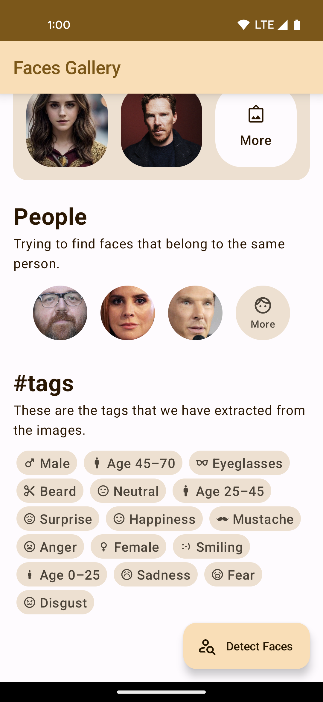
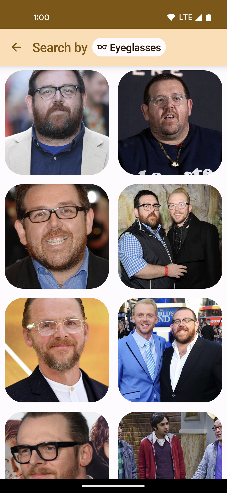
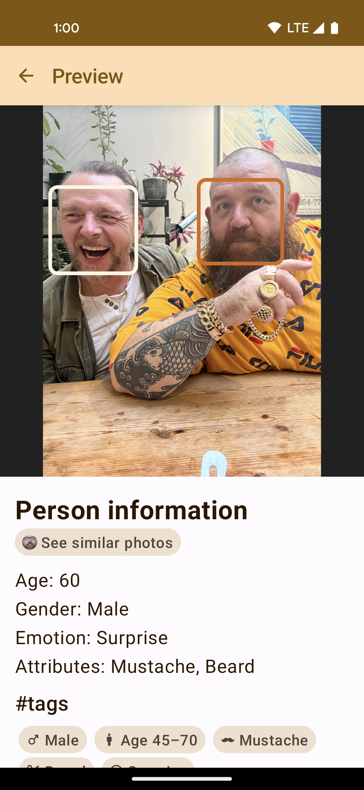
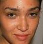
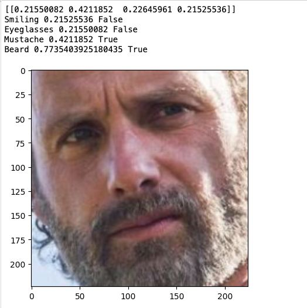
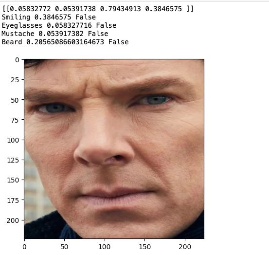
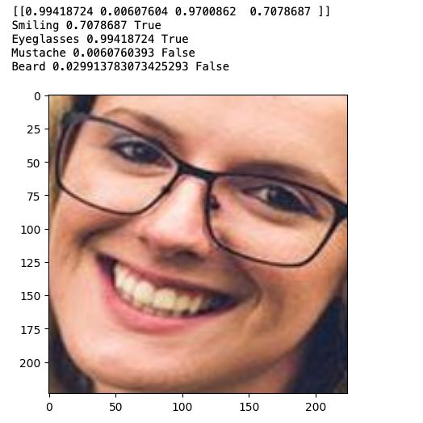

# Faces Gallery

Extracts faces from images inside your gallery and offers an overview of the analysis. 

| Feed                                     | Attributes                                    | Attributes search                                           | Detailed view                                                |
|------------------------------------------|-----------------------------------------------|-------------------------------------------------------------|--------------------------------------------------------------|
|  |  |  |  |

## Technologies

The application runs on **Android Lollipop and above**.

The main technologies used in the project:

- Kotlin + [Coroutines](https://kotlinlang.org/docs/coroutines-overview.html)
- [Jetpack Compose](https://developer.android.com/jetpack/compose): a robust technology to build UI
- [Room](https://developer.android.com/training/data-storage/room): Android persistence library
- [Tensorflow Lite](https://www.tensorflow.org/lite/android): Framework for running ML models on mobile

## Pre-work

Facial Attributes extraction with [CelebA](https://mmlab.ie.cuhk.edu.hk/projects/CelebA.html).

There are not much pretrained weights/models that are able to extract facial attributes. Moreover, I had
a few additional hard and soft requirements: it should be small _(below 40Mb)_ as I run it on edge devices
and big models will likely lead to [OOM](https://developer.android.com/topic/performance/memory), it should
extract facial attributes I am interested in _(at least beard or eyeglasses), and, ideally, it should be
a Keras or TFLite model. At least, I was not able to find any that satisfy the criteria 😅

At this point I decided to train my own model. I decided to stop on 4 facial attributes from CelebA:
**🕶️ eyeglasses, 🧔‍♂️ beard, 🙂 smiling, and mustache**.

### CelebA preprocessing

Raw CelebA images are too noisy and contains too much details, therefore I preprocessed the dataset.
I used OpenCV and DLib to detect faces, and saved them in a separate folder. Some images **had more than
one face**, for example, a person and a bodyguard. There were about 50 of such images and I removed them
from the final dataset.

You can see the examples of processed images below:

| Example 1                                      | Example 2                                      | Example 3                                      | Example 4                                      |
|------------------------------------------------|------------------------------------------------|------------------------------------------------|------------------------------------------------|
|  |  |  |  |

### Training

I trained the model in the following settings:

- [MobileNetV3 Large](https://keras.io/api/applications/mobilenet/)
- No pretrained weights
- 100 epochs

### Results

- Accuracy: 0.9551
- F1 Score: 0.9359
- Precision: 0.9478
- Recall: 0.9257

| Example 1                                     | Example 2                                     | Example 3                                     |
|-----------------------------------------------|-----------------------------------------------|-----------------------------------------------|
|  |  |  |

⚠️ The notebooks with pre-processing and training scripts can be found in [my gists](https://gist.github.com/st235/b3e658f383404acce551d8d7374a61bc).

⚠️⚠️ Pre-trained weights and TF Lite models can be found in [my Google Drive](https://drive.google.com/drive/folders/1y8XXubvsFeie4qDxjQEMzf3dV7uQFq8D?usp=sharing).

## Application

### General Overview

The application scans for the following attributes:
- Age
- Gender
- Emotion: anger, disgust, fear, happiness, neutral, sadness and surprise
- Smiling
- Beard
- Mustache
- Eyeglasses

The attributes are extracted with a few different models, specially trained for the tasks. You can find
  all of these pretrained models under [`raw` folder](./app/src/main/res/raw):
- Face Detection: [MobileNet V2 MediaPipe, Full Range](https://developers.google.com/mediapipe/solutions/vision/face_detector)
- Age: MobileNet MediaPipe
- Gender: MobileNet MediaPipe
- Emotions: MobileNet
- Facial Attributes: [MobileNet V3 Large, was trained in the scope of this project](#pre-work)
- Face Embeddings: FaceNet Mobile

### Cache

Caching is done via [SQLite](https://developer.android.com/training/data-storage/sqlite) as it allows
to organise data in a convenient manner and queries this data efficiently.

As an ORM framework I used Room [(see Technologies section for details)](#technologies).

There are 3 tables:
- Face
- Media File: I store them separately to save the processed images with **no faces** on them
- Clusters

The implementation of the persistent layer can be found under [`data` folder](./app/src/main/java/github/com/st235/facialprocessing/data).

### Clustering

Once the embeddings are extracted, they are clustered together based on the classical clustering algorithms.

There are 2 algorithms implemented for image clustering. All algorithms can be found under [`domain/clustering` folder](./app/src/main/java/github/com/st235/facialprocessing/domain/clustering):
- [DBSCAN](https://en.wikipedia.org/wiki/DBSCAN): [implementation](./app/src/main/java/github/com/st235/facialprocessing/domain/clustering/dbscan/DbscanClusterer.kt)
- [HDBSCAN](https://hdbscan.readthedocs.io/en/latest/how_hdbscan_works.html): [implementation](./app/src/main/java/github/com/st235/facialprocessing/domain/clustering/hdbscan/HdbscanClusterer.kt)

The final implementation of the app is using **HDBSCAN**.

## Misc

### Faces Gallery Youtube Playlist

Playlist with all demo videos is available here: [https://youtube.com/playlist?list=PLucKuGqiOAE9fzt8duUc5qnq8mX8c6ReO&si=ZIqqumO2ytc7DrRv](https://youtube.com/playlist?list=PLucKuGqiOAE9fzt8duUc5qnq8mX8c6ReO&si=ZIqqumO2ytc7DrRv)

Videos from the playlist are:

- **Main Flow Demo**: https://youtu.be/IaZfJUDsUow?si=5CkpuchyM09qzpxH
- **Photos review**: https://youtu.be/652KHTUCkZk?si=dqetxw9qznth_iVh
- **Adding a new photo**: https://youtu.be/o1CulOjHrEo?si=A9HS7jy2v5NVejZu
- **Attributes Search**: https://youtu.be/iPUsTKsxL9M?si=XegyJUpExNBxjUi8
- **Person Search**: https://youtu.be/uAqx7uraQlM?si=PyOueC05wW4tqO0a

### Evaluation Criteria List

> 0-5: Processing of all photos from a gallery is supported

✅

> 0-5: The results of processing are stored in a file, so that it is not necessary to process the whole gallery after restart of the application

✅ See [Cache section](#cache)

> 0-5: The neural network models from examples provided for this course are used

✅ Pre-trained MobileNet for emotions recognition, see [General overview](#general-overview) 

> 0-10: At least one extra model (not presented in the examples provided for this course) for facial attribute recognition is used

✅ MediaPipe models for age and gender, custom pre-trained MobileNet V3 for 4 attributes (beard, eyeglasses, mustache, smiling), see [General overview](#general-overview)

> 0-10: Clustering identical faces by using face recognition model is supported

✅

> 0-5: At least one extra model (not presented in the examples provided for this course) for face recognition is used

✅ Mobile FaceNet, see [General overview](#general-overview)

0-15: Special face clustering methods that use specific of faces are implemented, e.g., https://personal.ie.cuhk.edu.hk/~ccloy/files/aaai_2018_merge.pdf

✅ HDBSCAN, see [Clustering section](#clustering)

> 0-15: Visualization of the results by grouping the photos with identical value of selected attribute

✅
